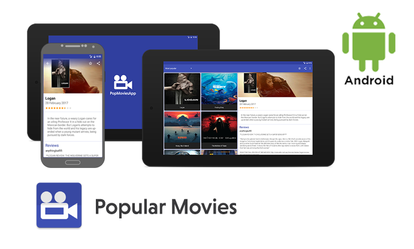
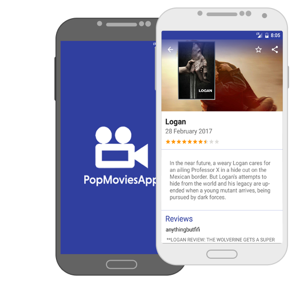
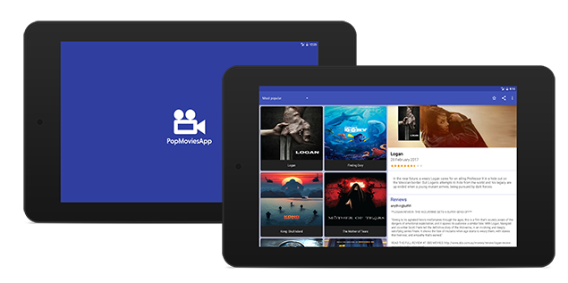

# Popular Movies v1.0.0 (themoviesdb.org API)



The PopularMoviesApp is an application, optimized for tablets, to help users discover popular and highly rated movies on the web. It displays a scrolling grid of movie trailers, launches a details screen whenever a particular movie is selected, allows users to save favorites, play trailers, and read user reviews. This app utilizes core Android user interface components and fetches movie information using themoviedb.org web API.

* [Screenshots](Screenshots/)





## Features
 * The app helps users with discover the most popular, the most rated or the highest rated movies
 * You can save movie to favorites
 * You can watch trailers
 * You can read reviews

## Libraries
 * [Support Design libraries](https://developer.android.com/topic/libraries/support-library/features.html) - Material design library
 * [Dagger 2](http://google.github.io/dagger/) - Dependency Injection library
 * [Butter Knife](http://jakewharton.github.io/butterknife/) - UI binding library
 * [Retrofit 2](http://square.github.io/retrofit/) - Web API library
 * [Picasso](http://square.github.io/picasso/) - Image handling library
 * [RxJava](https://github.com/ReactiveX/RxJava) - Asynchronous and event-based programs library
 * [SQLBrite](https://github.com/square/sqlbrite) - A lightweight wrapper around SQLiteOpenHelper and ContentResolver
 * [Timber](https://github.com/JakeWharton/timber) - Advanced logging library
 * [LeakCanary](https://github.com/square/leakcanary) - A memory leak detection library

## Udacity Nanodegree Popular Movies Project


 # License - Apache License, Version 2.0

 ```
 # (C) Copyright 2017 by Marek Hakala <hakala.marek@gmail.com>
 # Licensed under the Apache License, Version 2.0 (the "License");
 # you may not use this file except in compliance with the License.
 # You may obtain a copy of the License at
 #
 # http://www.apache.org/licenses/LICENSE-2.0
 #
 # Unless required by applicable law or agreed to in writing, software
 # distributed under the License is distributed on an "AS IS" BASIS,
 # WITHOUT WARRANTIES OR CONDITIONS OF ANY KIND, either express or implied.
 # See the License for the specific language governing permissions and
 #    limitations under the License.
 ```
